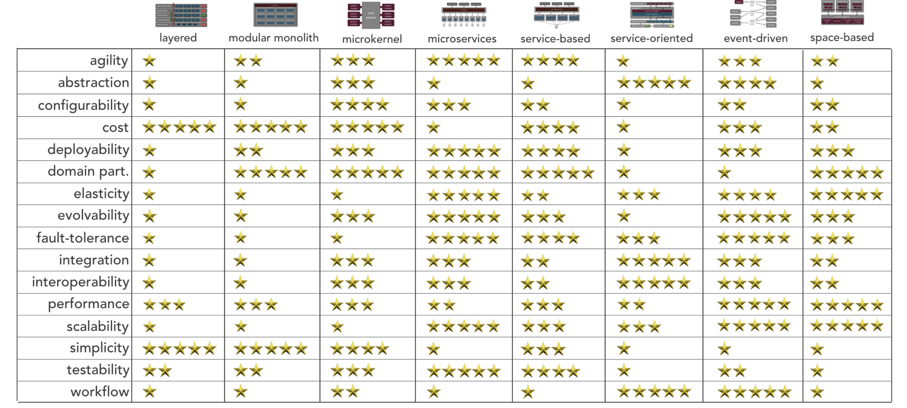

---

# Architecture Style Analysis

## Key Architectural Characteristics

The topkey architectural characteristics that were identified help us to select and overall architecture style. 

- Availability
- Fault tolerance
- Security
- Data integrity
- Workflow
- Abstraction

The top 3 of them are:

- **Fault tolerance**
- **Workflow**
- **Abstraction**

## Architecture Capabilities Comparison

## Architecture Capabilities Analysis

The above matrix gives us some candidates for the architecture, which need further analysis:

## Conclusion

## Decision

ADRs:

## Resources

- [Architecture styles worksheet by developertoarchitect.com](https://www.developertoarchitect.com/downloads/architecture-styles-worksheet.pdf)

