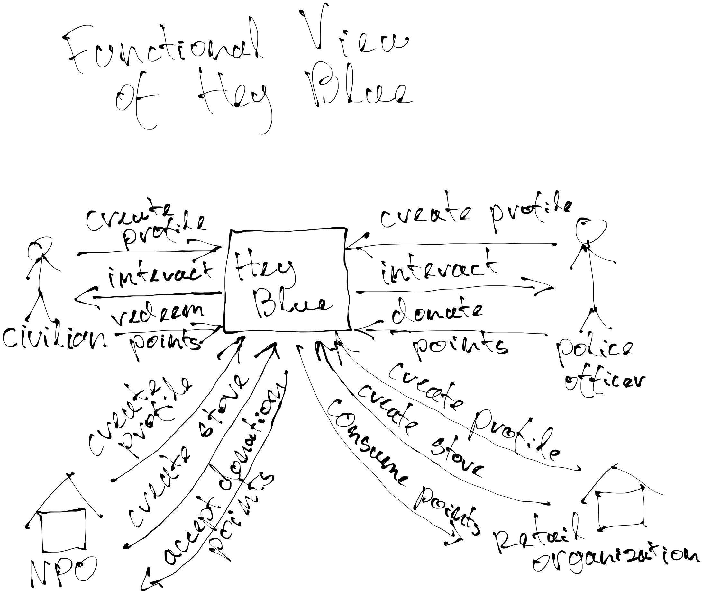

[> Home](../../README.md)    [> View](../README.md)
[< Prev](../Scenario%20Flow%20Diagrams/README.md)  |  [Next >](../Scenario%20Flow%20Diagrams/README.md)

---

# Functional View

The view provides a comperhensive overview of the functionality of the overall system as seen by a business person. 

To come up with this view, we consider Hey Blue as a black box, and determine how different real world elements interact with it.

All the boxes in this diagram are real systems and people.

If we zoom into Hey Blue box we'd have our software components.

From here on it makes sense to look at C4 Models to see what the software context is, what containers it has, and what components those containers contain, so as to provide this functionality.

